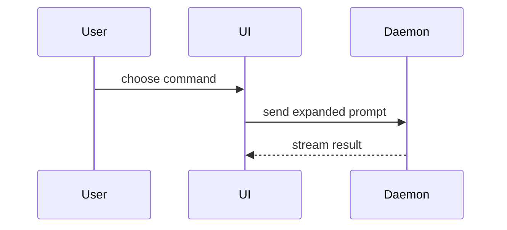

# PR

A generic PR body rehashes the diff under "Summary" and pads out a "Test plan" checklist: it answers *what* changed, never *why*, *how risky*, or what to watch for. Fill this shape instead:

```markdown
## Summary
<1-3 sentences, from the primary source, stating why>

**Size:** <N files, +A/-B lines>  **Door:** <one-way | two-way> (<reason>)

## The shape of the change
<diagram, diff-sketch, or tree>

## Evidence
- **Before:** <screenshot/output/failing test run>
  **After:** <screenshot/output/passing test run>
  Rules out: <specific failure>

## Left out, on purpose
- <thing deliberately not handled, and why>

## Not sure about
- <a real doubt, if one exists; drop the section otherwise>
```

## Summary

Draw it from the primary source: the issue, the spec, a path handed to you, or a spec file under `docs/`, `specs/`, or `.scratch/` matching the branch. The diff is evidence for *how*; it cannot supply *why*, and a summary built only from the diff will invent one that sounds right and isn't. Found nothing upstream? Say so, rather than presenting a diff-inferred guess as fact.

Name concepts with the repo's own glossary term (`CONTEXT.md`), and say so directly if the diff contradicts a documented ADR, rather than describing the new behaviour as if the old decision never existed.

## Size and door

One line, stated before the reviewer starts reading: files touched, lines added/removed.

The door is a judgement call the author makes explicitly, not left for the reviewer to infer from the diff's size: **one-way** (expensive to reverse: a migration, a deleted column, a public API change) or **two-way** (cheap to revert: additive, flagged, internal). Size and reversibility are different axes: a big mechanical rename is two-way, a one-line dropped column is one-way.

## The shape of the change

`show-me`'s technique (credited in `CREDITS.md`), aimed at a diff. Pick the smallest view that makes the shape of the change land, embedded directly in the body, never a standalone HTML artifact.

- Show logic or an algorithm as pseudocode:

```text
on(save)
  if content is unchanged
    return cached result
  write new content
  return fresh result
```

- Show runtime control flow as a call tree:

```text
submitForm
  createSession
    persistPrompt
    launchAgent
  navigateToSession
```

- Show UI structure as a component tree, including state and module boundaries that matter:

```tsx
<SessionPage> (apps/example/src/routes/session.tsx)
  useSessionEvents()
  <SessionToolbar>
    <RunSkillButton> (packages/ui)
```

- Show file responsibility or a broad refactor as a shallow file tree:

```text
src/
├── commands/       # parses user actions
├── sessions/       # owns session state
└── transport/      # sends API requests
```

- Show component interaction, control flow, or data flow with Mermaid:



- Use `diff` when the point is what changes and the surrounding shape already exists. Match the diff shape to the topic.

For a component change:

```diff
 <SessionPage>
   useSessionEvents()
   <SessionToolbar>
+    <RunSkillButton />
   <SessionTimeline>
+    <SkillResultCard />
```

For a file-layout change:

```diff
 src/
 ├── commands/
+│   └── show-me.ts       # expands the slash command
 ├── sessions/
-└── transport.ts
+└── transport/
+    ├── client.ts
+    └── stream.ts
```

For a call-tree or call-stack change:

```diff
 submitForm
   createSession
     persistPrompt
+    expandSkillMention
     launchAgent
-  navigateToSession
+  navigateToSession
+    subscribeToEvents
```

For a state or control-flow change:

```diff
 on(save)
-  write content
+  if content is unchanged
+    return cached result
+  write new content
+  invalidate cache
```

- Show the whole block when most of it is new, when omitted context would hide ownership or order, or when the reviewer needs a copyable target shape:

```ts
function expandSkill(command: string): string {
  const skillName = command.slice(1)
  return `use the ${skillName} skill`
}
```

Place each visual next to the short text it supports. Keep only the calls, files, props, states, and boundaries needed to make the change clear to a reviewer. Use one, occasionally two; never all of them.

## Evidence

A single after-the-fact snapshot (one screenshot, one green run) proves the current state works, not that this diff is what changed it. Show a **before/after pair**: a screenshot or output comparison for the same input first; a test failing on the base commit and passing on the branch only when nothing visual exists. Name the failure each pair rules out. "Tests pass" alone rules out nothing a tautological test wouldn't also pass.

## Left out, on purpose

What the diff deliberately doesn't handle, including things adjacent to it a reviewer might expect. Report only what you considered and skipped: you can't reliably report what you never thought of, so don't claim the list is exhaustive.
